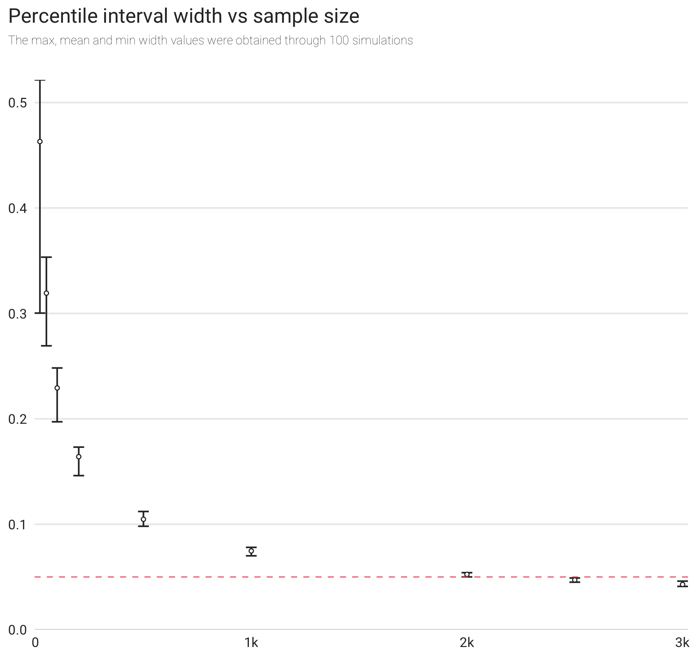

# Notes

The contents of this folder are adapted from the homework of the _Statistical Rethinking: A Bayesian Course Using R and Stan_ course whose instructor is Professor Richard McElreath. For more information, please check [this repo](https://github.com/rmcelreath/statrethinking_winter2019).

## Installation of the relevant packages

## Week 1

